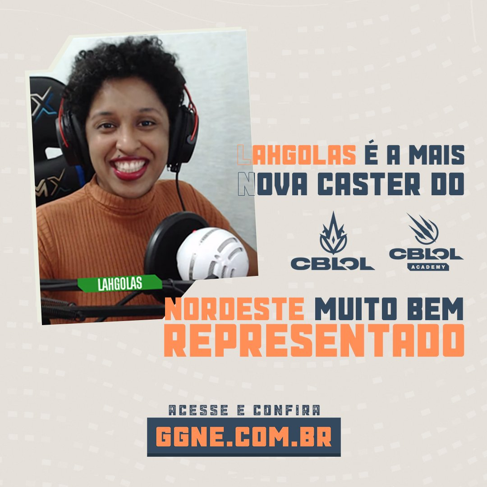

# Mulheres nos eSports: coletivos e ações que lutam por inclusão
## Iniciativas buscam por profissionalização das mulheres no mercado gamer
### Categoria: eSports

O crescente número de mulheres atuando no mercado de esportes eletrônicos se dá muito pelo impacto gerado por coletivos e ações que lutam por inclusão e combatem a desigualdade de gênero no meio gamer. Fato é: a realidade já se mostra com mulheres reafirmando um espaço que sempre foi seu de direito nos games.

Layze "Lahgolas", **a primeira caster mulher preta contratada pela Riot Games**, é exemplo de como é necessário que se invista em espaços seguros e em oportunidades para que mais mulheres participem do cenário - seja como *casters*, jogadoras, *streamers* ou qualquer outra profissão. Lahgolas foi acolhida pela `Wakanda Streamers` e teve junto à Sakuras uma oportunidade de se lançar no mercado.

Falar sobre coletivos implica também abordar sobre campeonatos femininos. Já consideradas polêmicas, iniciativas como ligas exclusivamente para mulheres não têm a intenção de excluir, mas sim de incluir. É sobre dar a visibilidade que muitas não conseguem em grandes torneios (que são, a priori, mistas) e afastá-las do comportamento tóxico que muitos homens ainda produzem dentro dos eSports, como a [onda de exposed puxada pela denúncia contra Gabriel "MiT" (LoL)](https://ge.globo.com/esports/noticia/exposed-nos-esports-os-casos-de-violencia-sexual-machismo-e-outros-abusos.ghtml), no início desse ano.

Casos como o de Júlia "Mayumi", ex-suporte da INTZ, que saiu da equipe após não disputar uma partida oficial sequer em 2020, evidenciam como oportunidades não são dadas igualmente e reforçam a importância das iniciativas listadas a seguir.
>  **Sakuras**
>  
>  A Sakuras eSports é uma organização que visa aumentar a visibilidade para as mulheres no cenário dos esportes eletrônicos promovendo uma plataforma para competidoras e criadoras de conteúdo. É um trabalho que gira em torno de campeonatos femininos, divulgação de streamings e conteúdo produzido por mulheres. 

 É um trabalho que gira em torno de:
 
 * campeonatos femininos
 
 * divulgação de streamings
 
 * conteúdo produzido por mulheres

> **Projeto Valkirias**
>
> O Projeto Valkirias visa treinar e preparar mulheres para o cenário competitivo dos eSports de forma gratuita, contando com times competitivos e promovendo campeonatos. A iniciativa foi criada por Pamela Mosquer, streamer e atual talent manager da Vivo Keyd.
 
 Torneio Valkirias, de PUBG Mobile | Premiações 
 ----------------------------------|------------------------
 Campeão                           |  R$ 20 mil
 Vice                              |  R$13 mil
 3º e 4º lugares                   |  R$ 7,5 mil cada

